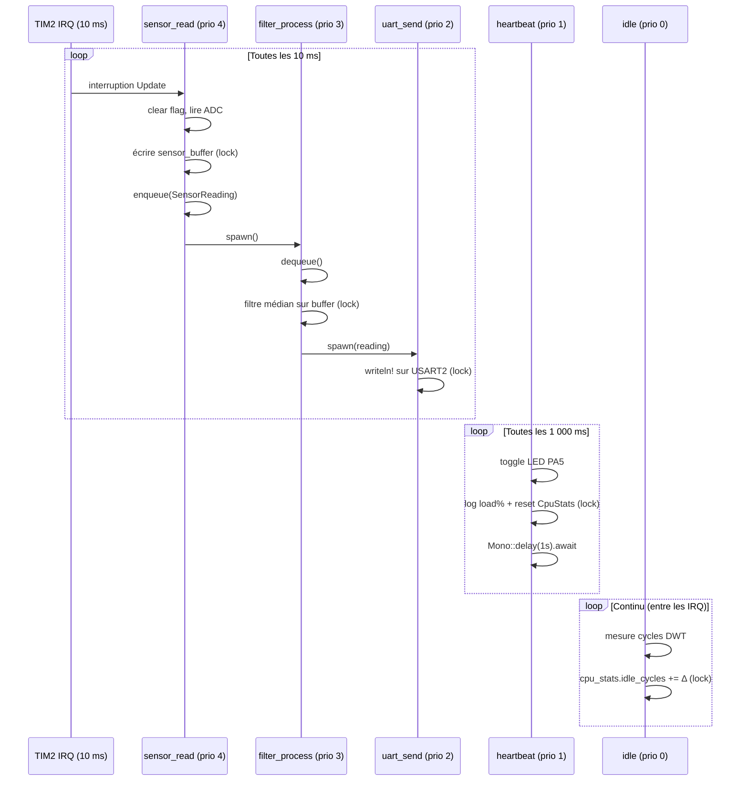

# rtic-scheduler

Firmware multitâche temps réel pour STM32F411 (Nucleo-F411RE) en Rust, construit avec **RTIC v2**.  
Démontre l'ordonnancement par priorité matérielle Cortex-M4, les ressources partagées sans data race,
la messagerie inter-tâches lock-free et la mesure de charge CPU via DWT.

---

## Architecture des tâches

| Tâche | Type | Priorité | Période | Rôle |
|---|---|---|---|---|
| `sensor_read` | hardware (TIM2 IRQ) | 4 (haute) | 10 ms | Lecture ADC + push queue |
| `filter_process` | software async | 3 | déclenchée | Filtre médian sur buffer |
| `uart_send` | software async | 2 | déclenchée | Envoi données formatées USART2 |
| `heartbeat` | software async | 1 (basse) | 1 000 ms | Blink LED LD2 + log charge CPU |
| `idle` | idle task | 0 | continu | Mesure charge CPU (DWT) |

---

## Diagramme de séquence



---

## Modèle de priorité RTIC

RTIC v2 exploite directement le **NVIC (Nested Vector Interrupt Controller)** du Cortex-M4.
Chaque tâche a une priorité matérielle : pas de scheduler logiciel, pas de context switch OS.

### Préemption

Si `sensor_read` (prio 4) se déclenche pendant que `heartbeat` (prio 1) tourne, le NVIC
**préempte immédiatement** `heartbeat` sans intervention logicielle. La latence de réponse
est garantie ≤ quelques cycles.

### Priority Ceiling Protocol

Quand deux tâches accèdent à la même ressource `#[shared]`, RTIC génère un **priority ceiling** :
pendant le `.lock()`, les interruptions de priorité inférieure au ceiling sont masquées via BASEPRI.
Cela garantit l'**exclusion mutuelle sans Mutex runtime** — le compilateur Rust vérifie statiquement
qu'il n'y a aucune data race possible.

```
Ressource        | Tâches qui l'accèdent         | Ceiling
sensor_buffer    | sensor_read(4), filter_process(3) | 4
uart             | uart_send(2)                   | 2
cpu_stats        | heartbeat(1), idle(0)          | 1
```

### Dispatchers

Les tâches `async` (software) sont dispatchées via des IRQ libres :

```
EXTI0 → dispatcher priorité 3 (filter_process)
EXTI1 → dispatcher priorité 2 (uart_send)
EXTI2 → dispatcher priorité 1 (heartbeat)
```

---

## Ressources partagées

```rust
#[shared]
struct Shared {
    sensor_buffer: [u16; 32],  // buffer de mesures — lock ceiling 4
    uart: Tx<USART2>,          // USART2 TX — lock ceiling 2
    cpu_stats: CpuStats,       // charge CPU — lock ceiling 1
}

#[local]
struct Local {
    led: PA5<Output<PushPull>>, // LED LD2 — exclusive à heartbeat
    tim2: CounterMs<TIM2>,      // timer — exclusive à sensor_read
    sensor_producer: Producer<'static, SensorReading, 16>,
    sensor_consumer: Consumer<'static, SensorReading, 16>,
}
```

---

## Mesure charge CPU

Le **DWT cycle counter** (32 bits, incrémenté à chaque cycle à 84 MHz) est activé dans `init`.
`idle` mesure en continu les cycles passés en idle vs le total.
`heartbeat` lit et remet à zéro la fenêtre toutes les secondes.

```
charge (%) = (total_cycles - idle_cycles) / total_cycles × 100
```

Le compteur déborde toutes les ~51 s — `wrapping_sub` garantit la correction même après débordement.

---

## Queue inter-tâches

```
static Queue<SensorReading, 16>  (heapless SPSC)
      │
      ├─ Producer → local à sensor_read  (écrit à prio 4)
      └─ Consumer → local à filter_process (lit à prio 3)
```

SPSC (Single Producer Single Consumer) est lock-free par construction — pas besoin de protection
supplémentaire car producer et consumer sont dans des tâches distinctes.

---

## Build & Flash

```bash
# Ajouter la cible (une seule fois)
rustup target add thumbv7em-none-eabihf

# Compilation debug
cargo build

# Compilation release (optimisée taille)
cargo build --release

# Flash + logs RTT via probe-rs
cargo embed --release
```

---

## Prérequis matériel

- Carte : **STM32F411 Nucleo-F411RE**
- Câble : USB-A → Mini-USB (ST-Link intégré)
- LED : LD2 (PA5) — intégrée, aucun composant externe requis
- UART : PA2 (TX) via ST-Link VCP @ 115 200 baud

---

## Dépendances clés

| Crate | Rôle |
|---|---|
| `rtic 2.x` | Framework RTIC, ordonnancement par priorité |
| `rtic-monotonics` | Timer monotonique Systick pour `delay().await` |
| `stm32f4xx-hal` | HAL STM32F4 (GPIO, UART, TIM, DWT) |
| `heapless` | Queue SPSC statique, no_std |
| `defmt` + `defmt-rtt` | Logging binaire via RTT |
| `panic-probe` | Panic handler → backtrace via defmt |
